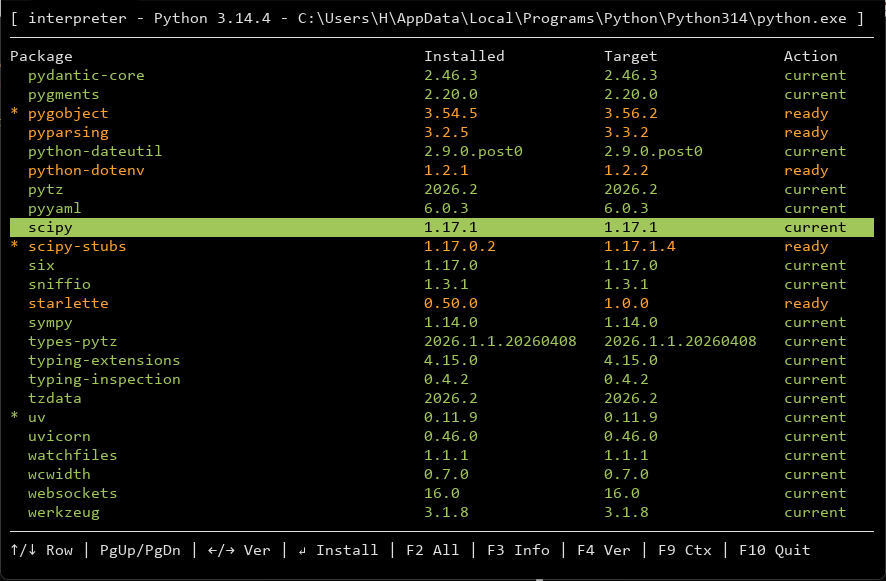
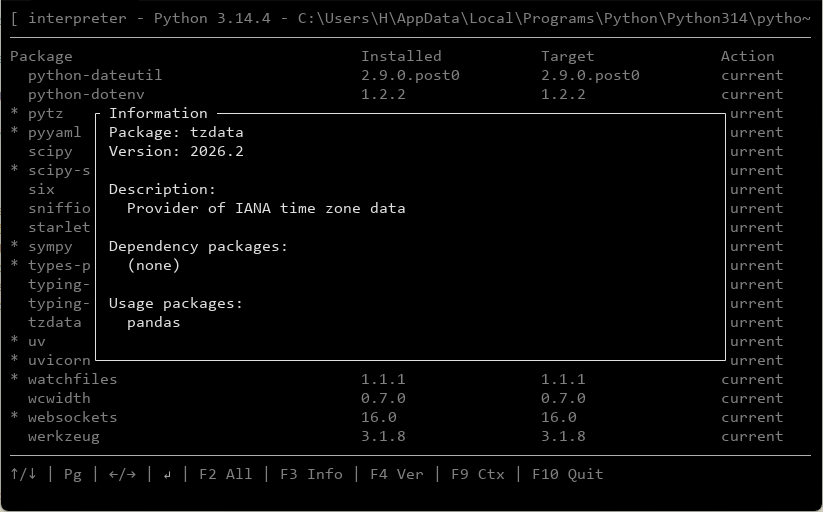

# Tuv

Tuv is a small alternate-screen terminal UI for managing installed Python packages with `uv`. It discovers Python interpreters and local virtual environments, shows packages in a compact table, lets you choose target versions, and runs installs without leaving the terminal.

## Demo

Main package table:



Package information dialog:



## Highlights

- Native terminal UI in one Python file, with no TUI framework dependency.
- `uv` backend invoked as `python -m uv`; no bare `uv` executable is required on `PATH`.
- Context selector for the Tuv runner venv, active venvs, local venvs, and discovered interpreters.
- Alphabetical package table with installed version, target version, and install status.
- Async installs with a responsive UI and sequential update-all behavior.
- Package info panel with dependency and usage-package lists.

## Run

Windows:

```bat
tuv.bat
```

Linux and macOS:

```sh
./tuv.sh
```

Run Tuv from a project directory to make its local Python and virtual environments easy to pick in the context selector:

```bat
cd C:\projects\my-app
tuv.bat
```

```sh
cd ~/projects/my-app
./tuv.sh
```

Use the dot argument when you explicitly want the current directory's Python to be used as Tuv's runner Python:

```bat
cd C:\tools\python-3.13
tuv.bat .
```

```sh
cd ~/tools/python-3.13
./tuv.sh .
```

The launcher discovers a usable Python, creates or reuses a script-relative runner environment, installs `requirements.txt`, ensures runner-local `uv`, and starts `tuv.py`.

## Keys

| Key | Action |
| --- | --- |
| Up / Down | Move package selection |
| PageUp / PageDown | Jump through rows |
| Left / Right | Select older or newer target version |
| Enter | Install selected target version |
| F2 | Update all ready packages after confirmation |
| F3 | Show package information |
| F4 | Open version selector |
| F9 | Open context selector |
| Esc / q | Close dialogs and selectors |
| F10 / q | Quit from the main screen |

## Project Files

- `tuv.py`: application implementation.
- `tuv.bat`: Windows launcher.
- `tuv.sh`: Linux/macOS launcher.
- `requirements.txt`: runner dependencies.
- `spec.md`: detailed behavior specification.
